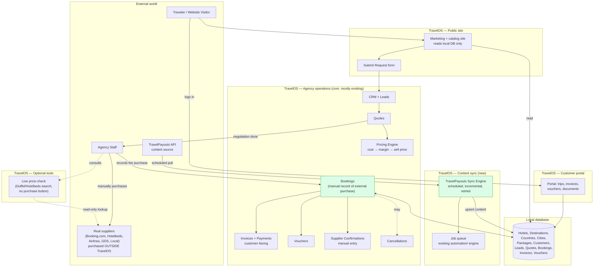
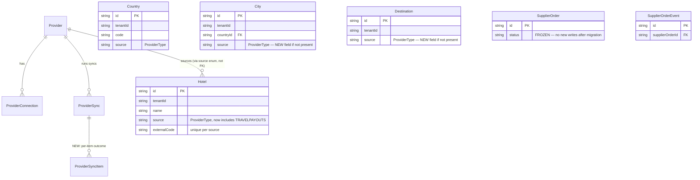
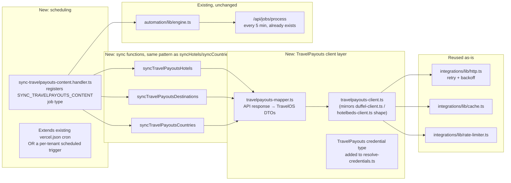

# TravelOS — Architecture Pivot Plan: OTA-Execution Engine → Agency Operations OS

**Status:** DRAFT — awaiting approval. No code, schema, or dependency changes have been made.
**Prepared as:** architectural audit + migration plan, per explicit request. This document is the
deliverable; nothing in it has been implemented.

---

## 0. Reading guide

This document answers the ten items requested, in order:

1. [Migration plan](#1-migration-plan) (§1)
2. [Dependency map](#2-dependency-map) (§2)
3. [Modules that remain useful](#3-modules-that-remain-useful-unchanged-or-nearly-so) (§3)
4. [Modules that become optional](#4-modules-that-become-optional) (§4)
5. [Modules that should be removed](#5-modules-that-should-be-removed) (§5)
6. [New roadmap](#6-new-roadmap) (§6)
7. [New architecture diagram](#7-new-architecture-diagram) (§7)
8. [New database diagram](#8-new-database-diagram-delta-only) (§8)
9. [TravelPayouts synchronization architecture](#9-travelpayouts-synchronization-architecture) (§9)
10. [Detailed implementation plan](#10-detailed-implementation-plan) (§10)

Everything here is grounded in the **current, actual codebase** (file paths cited), not
assumptions. Where I found something already close to what the new vision needs, I say so —
this pivot is smaller than it sounds, because most of the "agency operations" layer (invoices,
payments, vouchers, confirmations, cancellations) was already built as manual-recording systems,
not automated purchase systems. The part that must go is narrower and more contained than the
whole booking stack: it's specifically the *live-purchase-execution* slice.

---

## 1. Migration plan

### 1.1 The core insight that shapes this whole plan

I audited every module that touches suppliers, bookings, or payments before writing anything
below. The finding that matters most:

> **TravelOS never actually executes a customer payment today.** The `Payment`/`PaymentTransaction`
> models under `src/features/payments` and `src/features/invoices` already just *record* what the
> agency collected from the customer — there is no payment-gateway charge anywhere in that code
> path. Similarly, `SupplierConfirmation` (`src/features/confirmations/actions/confirmation.action.ts`)
> is **already** a manual "staff typed in the supplier's confirmation number" workflow — it was
> never wired to an automated confirmation API. `Voucher`, `CancellationPolicy`, and the customer
> `Invoice` are all the same: human-entered records of what happened, not automated transaction
> engines.

The one part of the codebase that **does** call a live supplier API to attempt a real purchase is
narrow and clearly bounded:

- `src/features/supplier-execution/**` (the whole feature)
- `src/features/integrations/actions/booking-prep.action.ts` (revalidates a live rate, then
  auto-creates a `Booking` from it)
- The "Create booking" button inside `duffel-explorer.tsx` / `hotelbeds-explorer.tsx` /
  `create-booking-dialog.tsx`
- `src/features/automation/handlers/reconcile-supplier-order.handler.ts` and
  `src/features/supplier-execution/lib/reconciliation*.ts` (the polling loop that checks whether
  a supplier order TravelOS itself placed has been confirmed)
- The `SupplierOrder` / `SupplierOrderEvent` Prisma models and their enums
  (`SupplierOrderStatus`, `SupplierPaymentMode`, `SupplierOrderEventType`)
- `ProviderWebhook` (turns out this is dead code today regardless of the pivot — see §1.4)

This is genuinely surgical. It is **not** "rip out bookings, invoices, CRM, quotes, or the
customer portal." Those stay almost untouched.

### 1.2 What actually changes, in one sentence per area

| Area | Change |
|---|---|
| Live supplier "book now" APIs (Duffel order creation, Hotelbeds booking confirmation) | **Removed.** Never called again. |
| Supplier order polling / reconciliation | **Removed.** Nothing to poll — TravelOS placed nothing. |
| `SupplierOrder` execution engine, idempotency, error classification | **Removed.** No purchase to make idempotent. |
| Provider webhooks | **Removed** (already dead code — no receiver route exists). |
| Live Duffel/Hotelbeds/Amadeus search explorers | **Demoted to optional internal tool.** Useful for staff to price-check while negotiating a quote; the "Create booking" action inside them is deleted. |
| `Booking`, `BookingItem`, `Quote`, `Invoice`, `Payment`, `Voucher`, `SupplierConfirmation`, `CancellationPolicy` | **Kept, unchanged schema.** Already manual-recording models. Add explicit "supplier cost / margin" surfacing (mostly already present via `BookingItem.supplierCost`, from the Universal Pricing Engine work). |
| CRM, Leads, Quotes | **Kept and become MORE central** — this is now the primary value-delivery path, not a side quest next to live booking. |
| Content (Hotels, Destinations, Packages) | **Gains a new ingestion source.** Currently 100% manually authored by agency staff. TravelPayouts sync becomes a second, additive way to populate `Hotel`/`Country`/`Destination`/`City` — the exact same tables, no new content model needed. |
| Provider credentials / connection infrastructure | **Narrows scope.** Stops being "OAuth into a live booking API," becomes "hold a TravelPayouts API token" plus, optionally, read-only search credentials for the price-check tool. |
| Automation / Job engine | **Kept and reused** — this is the mechanism the TravelPayouts sync scheduler runs on. It already has retry, backoff, dead-letter, and a working cron. |
| Billing (SaaS subscription for the agency's own TravelOS plan) | **Completely unaffected.** This was always a separate system (`BillingProvider`, Stripe/manual) from supplier execution — confirmed by reading both interfaces side by side. |

### 1.3 Why "do not delete anything yet" is the right call, and what I'd advise beyond it

Nothing will be deleted until you approve. Beyond that, I'd recommend **archiving, not
hard-deleting**, the execution stack even after approval — moving `supplier-execution/` and the
booking-prep live-purchase code path behind a feature flag or into a clearly-marked
`_deprecated/` location for one release cycle, rather than `git rm`. Reasons:

1. The `SupplierOrder` schema and engine represent real, correct engineering work (idempotency,
   compensation, error classification) that may become relevant again if TravelOS ever adds a
   genuine "book via API" tier as a premium feature for agencies with real Hotelbeds/Duffel
   accounts. Deleting it destroys institutional knowledge for no storage-cost reason.
2. Existing tenant data may already contain `SupplierOrder` rows (development/demo tenants).
   A migration needs to decide: keep the table (read-only, historical) or destructively drop it.
   I recommend **keep the table, stop writing to it** — cheaper and reversible.
3. It gives us a clean rollback path if something in the new content-sync direction turns out to
   be wrong.

### 1.4 A finding that simplifies things further

`ProviderWebhook` (schema model) and the "Add Webhook" UI in `provider-detail-tabs.tsx` have
**no live receiver** — I searched `src/app/api/**` and found only `auth`, `uploadthing`, and
`jobs/process`. There is no `/api/webhooks/*` route. This means webhook removal is a pure win
with zero behavioral change today; it was already inert. I mention it because the task explicitly
called out "booking webhooks" as a category to identify — confirmed dead, independent of the
pivot.

---

## 2. Dependency map

This shows what depends on what, so removal order is safe (always remove leaves before roots).

```mermaid
graph TD
    subgraph "TO REMOVE"
        SE[supplier-execution feature]
        SOM[SupplierOrder / SupplierOrderEvent models]
        RECON[reconcile-supplier-order.handler.ts]
        BOOKPREP[booking-prep.action.ts<br/>live-purchase path only]
        CREATEBOOK[create-booking-dialog.tsx<br/>Create booking button]
        WEBHOOK[ProviderWebhook model + UI]
    end

    subgraph "TO BECOME OPTIONAL"
        EXPLORER[duffel-explorer.tsx / hotelbeds-explorer.tsx<br/>price-check only]
        SYNCUI[sync-manager.tsx<br/>generalized to multi-source]
        AMADEUS[amadeus-panel.tsx]
        PROVIDERS[providers feature<br/>credential mgmt, narrowed scope]
    end

    subgraph "STAYS — reused as infrastructure"
        JOBENGINE[automation/ Job engine + cron]
        SYNCSVC[integrations/sync/sync-service.ts<br/>generalized pattern]
        INTCLIENT[integrations/lib/http.ts, cache.ts,<br/>rate-limiter.ts, client-factory.ts]
    end

    subgraph "STAYS — core product, unchanged"
        CRM[crm, leads]
        QUOTES[quotes]
        BOOKINGCORE[bookings — manual CRUD path]
        INVOICES[invoices, payments — customer-facing]
        VOUCHERS[vouchers]
        CONFIRM[confirmations — manual entry]
        CANCEL[cancellations]
        TRAVELLERS[travellers]
        PORTAL[portal — customer-facing]
        CONTENT[hotels, destinations, packages,<br/>package-inventory, activities, guides, transport]
        PRICING[pricing engine]
        BILLING[billing — SaaS subscription, unrelated system]
        SETTINGS[settings, tenants, auth]
    end

    SE --> SOM
    SE --> RECON
    RECON --> JOBENGINE
    BOOKPREP --> SE
    CREATEBOOK --> BOOKPREP
    CREATEBOOK --> EXPLORER

    QUOTES -->|"quote → booking conversion,<br/>already manual, NOT touched"| BOOKINGCORE
    BOOKINGCORE --> INVOICES
    BOOKINGCORE --> VOUCHERS
    BOOKINGCORE --> CONFIRM
    BOOKINGCORE --> CANCEL
    BOOKINGCORE --> TRAVELLERS
    BOOKINGCORE -.optional cost tracking.-> PRICING

    SYNCUI --> SYNCSVC
    SYNCSVC --> INTCLIENT
    SYNCSVC -.will add.-> TPSYNC[NEW: TravelPayouts importer]
    TPSYNC --> JOBENGINE
    TPSYNC --> CONTENT

    PORTAL --> BOOKINGCORE
    PORTAL --> INVOICES
    PORTAL --> VOUCHERS

    classDef remove fill:#fee2e2,stroke:#dc2626,color:#7f1d1d
    classDef optional fill:#fef3c7,stroke:#d97706,color:#78350f
    classDef infra fill:#dbeafe,stroke:#2563eb,color:#1e3a8a
    classDef core fill:#dcfce7,stroke:#16a34a,color:#14532d

    class SE,SOM,RECON,BOOKPREP,CREATEBOOK,WEBHOOK remove
    class EXPLORER,SYNCUI,AMADEUS,PROVIDERS optional
    class JOBENGINE,SYNCSVC,INTCLIENT,TPSYNC infra
    class CRM,QUOTES,BOOKINGCORE,INVOICES,VOUCHERS,CONFIRM,CANCEL,TRAVELLERS,PORTAL,CONTENT,PRICING,BILLING,SETTINGS core
```

**Removal order** (leaves first, so nothing references a deleted symbol mid-migration):

1. `create-booking-dialog.tsx`'s "Create booking" action → delete the call site first.
2. `booking-prep.action.ts` → delete the live-purchase functions (`prepareFlightBooking`,
   `prepareHotelBooking` or equivalent — verify exact names during implementation).
3. `reconcile-supplier-order.handler.ts` → unregister from `automation/handlers/register.ts`.
4. `supplier-execution/**` feature directory → delete last, once nothing calls into it.
5. Schema: mark `SupplierOrder`/`SupplierOrderEvent` as legacy-read-only (see §8), don't drop the
   table in the first migration.
6. `ProviderWebhook` model + its action functions + UI form → safe to remove any time, no ordering
   constraint (already unreferenced by a live receiver).

---

## 3. Modules that remain useful (unchanged, or nearly so)

These need **no architectural change**. Some get minor UI copy adjustments (see §10) to stop
implying "TravelOS booked this for you," but no schema or logic changes.

| Module | Why it stays as-is |
|---|---|
| `crm/` (Customers, Companies, Contacts, Notes, Timeline, Tags) | Already the system of record for the client relationship — becomes *more* important, not less. |
| `leads/` | The "Submit Request → Lead enters CRM" step in the new client journey maps directly onto this existing pipeline (stages, assignment, conversion, reminders). |
| `quotes/` | Already a human-authored, human-priced document. The "Negotiation → Quotation" step is this module. |
| `bookings/` (manual CRUD path — `booking.action.ts`'s `createBookingAction`, list/detail/status) | This is exactly "Agency records purchase → Booking." Was always usable standalone; only the live-purchase *shortcut into it* is removed. |
| `travellers/` | Passenger/traveller records on a booking — unaffected by how the booking was created. |
| `invoices/`, `payments/` (customer-facing) | Already just record what the customer paid the agency. Confirmed no payment-gateway execution exists in this code path today. |
| `vouchers/` | Already a "generate a printable confirmation document from booking data" feature — supplier-agnostic. |
| `confirmations/` | Already `requestConfirmationAction`/`confirmConfirmationAction`/`rejectConfirmationAction` — 100% staff-entered (verified by reading `confirmation.action.ts` in full). This is precisely where "supplier confirmation number" from the new spec belongs. |
| `cancellations/` | Policy + refund-math engine operates on booking/invoice data the agency controls; no supplier API call. |
| `pricing/` | The Universal Pricing Engine computes selling price from cost + margin rules — this is exactly "Supplier cost / Selling price / Margin" from the new spec, already built. |
| `portal/` (customer-facing) | Shows the customer their trip, documents, invoices, vouchers — all sourced from the manual records above. Unaffected. |
| `hotels/`, `destinations/`, `activities/`, `guides/`, `transport/`, `suppliers/`, `packages/`, `package-inventory/` | This is the content catalog. Gains a second ingestion path (TravelPayouts) alongside the existing manual CRUD; the manual path is untouched. |
| `documents/` | Generic document storage (passports, contracts) — supplier-agnostic. |
| `billing/` | SaaS subscription billing for the agency's *own* TravelOS plan (Stripe/manual `BillingProvider`) — a completely separate system from supplier payment execution, confirmed by reading the interface. |
| `settings/`, `tenants/`, `auth/`, `users/` | Platform plumbing, unaffected. |
| `automation/` (Job engine, retry, cron) | Reused as the TravelPayouts sync scheduler — see §9. |
| `search/` | Internal catalog search only (never queried a live supplier). |
| `integrations/lib/http.ts`, `cache.ts`, `rate-limiter.ts` | Generic HTTP client infrastructure (retry, backoff, caching) — provider-agnostic, directly reusable for the TravelPayouts client. |
| `integrations/sync/sync-service.ts` | The pattern (not the Hotelbeds-specific functions) is the template for the new TravelPayouts importer — see §9. |

---

## 4. Modules that should become optional

"Optional" = kept in the codebase and functional, but gated behind a settings toggle or an
internal/staff-only surface, because they represent capability an agency *may* still want
(price transparency while negotiating) but that is no longer core to the product's identity.

| Module | Why optional, not removed | Proposed gating |
|---|---|---|
| `integrations/components/duffel-explorer.tsx`, `hotelbeds-explorer.tsx` | Useful as a **read-only price-check tool** — staff can look up live rates while preparing a quote, without TravelOS ever purchasing anything. This is a legitimate, valuable feature under the new vision (informs the quote's selling price), just not core. | Rename conceptually to "Supplier Price Lookup"; strip the "Create booking" button; gate behind a settings flag `enableSupplierPriceLookup` (default on for agencies with their own Duffel/Hotelbeds credentials, irrelevant otherwise). |
| `integrations/components/amadeus-panel.tsx` | Amadeus was already the least-built-out integration (no execution provider was ever written for it — confirmed, only `amadeus-client.ts`/`amadeus-mapper.ts` exist, no `supplier-execution/providers/amadeus/`). Keep as the same kind of price-check tool. | Same as above. |
| `providers/` feature (credential management, connection wizard, health/monitoring tabs) | Still needed to hold API credentials for: (a) the optional price-check tools, (b) the new TravelPayouts content sync. Scope narrows — health/rate-limit/webhook tabs built for a "we call this API constantly for bookings" reality become far less relevant for "we call this API on a schedule to sync content." | Keep the credential storage + connection test; deprioritize/hide the webhook tab (§5); keep monitoring but expect much lower traffic. |
| `integrations/components/sync-manager.tsx` + `sync-service.ts` (Hotelbeds/Duffel reference-data importers: countries, destinations, hotels, amenities, airports, airlines) | Not required if an agency only uses TravelPayouts sync, but there's no reason to remove a working, tested content-import path — it can run alongside TravelPayouts as an alternate/supplementary source. | Kept as-is; TravelPayouts sync added as a new dataset/source in the same UI (§9), not a replacement. |
| `SupplierOrder`/`SupplierOrderEvent` tables (data, not code) | See §1.3 — kept read-only for historical/audit purposes on tenants that have existing rows. | No write path; a "Legacy execution records" read-only admin view, or nothing at all if zero production tenants have rows (confirm before deciding). |

---

## 5. Modules that should be removed

| Module / file | Reason |
|---|---|
| `src/features/supplier-execution/` (entire directory: `actions/execution.action.ts`, `components/supplier-execution-section.tsx`, `lib/engine.ts`, `lib/error-classification.ts`, `lib/idempotency.ts`, `lib/reconciliation.ts`, `lib/reconciliation-plan.ts`, `lib/status.ts`, `lib/types.ts`, `providers/duffel/duffel-execution-provider.ts`, `providers/hotelbeds/hotelbeds-execution-provider.ts`, `queries/list-supplier-orders.query.ts`, `schemas/execution.schema.ts`) | This entire feature exists to call a live supplier "create order" / "confirm booking" API and manage the resulting state machine. Under the new vision this action never happens — TravelOS never purchases. |
| `src/features/automation/handlers/reconcile-supplier-order.handler.ts` (+ its registration in `register.ts`) | Polls a supplier order TravelOS itself placed. No orders are ever placed, so nothing to poll. This is precisely the "ON REQUEST polling" the task calls out. |
| `src/features/integrations/actions/booking-prep.action.ts` — the live-purchase functions specifically (the ones that call `createBookingAction` after a live rate revalidation) | Auto-creating a `Booking` from a live rate implies TravelOS is "the booking engine." Under the new vision, a `Booking` is always agency-entered after a manual, external purchase. |
| `create-booking-dialog.tsx` and its wiring inside `duffel-explorer.tsx` / `hotelbeds-explorer.tsx` | The UI entry point for the above. |
| `ProviderWebhook` model, `addProviderWebhookAction`/`deleteProviderWebhookAction`, and the "Webhooks" tab in `provider-detail-tabs.tsx` | Already dead code (no receiver route exists) — doubly irrelevant now since webhooks were meant for supplier booking-status push notifications, a capability that no longer applies. |
| `SupplierOrderStatus`, `SupplierPaymentMode`, `SupplierOrderEventType` enums (schema) | Only consumed by the removed execution engine. |
| Any "Validate price / Create booking" call-to-action copy in the integrations UI that implies purchase | Copy-only, but worth an explicit sweep (see §10) — several button labels currently say "Create booking," which is now false. |

**Explicitly NOT removed:** `Provider`, `ProviderConnection`, `ProviderCredential`,
`ProviderCapability`, `ProviderLog`, `ProviderSync`, `ProviderError`, `ProviderHealth`,
`ProviderRateLimit` — these stay, narrowed in purpose (§4), because they're the generic
credential/connection/monitoring infrastructure the TravelPayouts integration will also use.

---

## 6. New roadmap

Phased so each phase ships a working, gate-passing product — never a broken intermediate state.

### Phase P0 — Content sync foundation (no removals yet)
Build the TravelPayouts client + importer + scheduled sync **additively**, alongside the existing
execution stack (which keeps working, untouched, during this phase). Ship this first so agencies
get value (richer content) immediately, and so we validate the sync architecture against a real
external API before touching anything load-bearing.

### Phase P1 — Decommission live purchase execution
Remove the modules listed in §5, in the dependency order from §2. Update UI copy that implied
automated booking. Add the "Record a manual purchase" flow that replaces "Create booking" (see
§10.3) — this is a UX improvement, not a regression, because it's honest about what actually
happens.

### Phase P2 — Strengthen the manual-purchase recording flow
The current `Booking` creation form is generic. Add fields/flow explicitly for: which supplier
was used (`Booking.com`, `Hotelbeds`, airline name, GDS, "Local supplier" — free text + a
short enum), the supplier confirmation number (already exists via `SupplierConfirmation`, just
needs to be surfaced earlier in the booking-creation flow instead of as an afterthought), and
supplier cost (already exists on `BookingItem.supplierCost` from the Pricing Engine work — needs
to become a *required, prominent* field in this flow instead of optional).

### Phase P3 — Content breadth
Expand the TravelPayouts importer beyond hotels (P0's scope) to whatever else TravelPayouts
exposes that's useful: richer facility/amenity taxonomies, more image variants, review/rating
data if available. Add incremental sync (only changed records) instead of full-batch re-sync.

### Phase P4 — Agency-facing polish
Dashboard and reporting reframed around the new journey: lead conversion rate, quote-to-booking
rate, margin per booking/per supplier, time-to-quote. None of this requires new data — it's all
computable from existing `Lead`, `Quote`, `Booking`, `BookingItem.supplierCost` records — it's a
reporting/analytics layer, explicitly out of scope for this document but worth flagging as the
natural next roadmap item after the pivot lands.

### Phase P5 (optional, later) — "Bring your own API" premium tier
If/when there's demand, the archived `supplier-execution` code (kept per §1.3, not deleted) could
be revived as an opt-in premium capability for agencies with their own Hotelbeds/Duffel commercial
accounts who *do* want live execution. This is explicitly speculative and not part of the approved
plan — noted only because "don't delete, archive" in §1.3 is what keeps this option open cheaply.

---

## 7. New architecture diagram

Key differences from the current architecture:

- **No arrow from any TravelOS module directly into "Suppliers"** for purchase execution — the
  *only* connection to real suppliers is (a) the optional read-only price-check tool, and (b) the
  agency's own manual, external action, which TravelOS has no visibility into except what the
  agency chooses to record afterward.
- **TravelPayouts sits where Hotelbeds/Duffel used to sit for content**, but strictly as a content
  source, never a booking target.
- **The Job engine gains a new primary tenant**: previously mostly `SEND_COMMUNICATION` +
  (soon-removed) `RECONCILE_SUPPLIER_ORDER`; now `SYNC_TRAVELPAYOUTS_CONTENT` becomes its main
  recurring job.

---

## 8. New database diagram (delta only)

Only showing what changes. Everything not shown here (Customer, Lead, Quote, Booking, Invoice,
Payment, Voucher, SupplierConfirmation, CancellationPolicy, Tenant, Membership, etc.) is
**unchanged** — that's the point: this pivot is schema-light.

Concretely, the schema changes are:

1. **`ProviderType` enum** — add `TRAVELPAYOUTS`. (Precedent: this enum already carries
   `BOOKING`, `EXPEDIA`, `TRAVELPORT` as unimplemented placeholders, confirmed unused anywhere
   except the type list — so this is a low-risk, consistent addition.)
2. **`Country`, `City`/`Destination` — confirm `source`/`externalCode` fields exist or add them**,
   mirroring the pattern `Hotel` already has (`source: ProviderType?`, `externalCode: String?`,
   with a `@@index([tenantId, source, externalCode])`). This needs a schema read during
   implementation to confirm which reference models already have this pair and which don't (my
   audit confirmed `Hotel` has it; `Country`/`City` need verification — the sync-service already
   upserts them keyed by `[tenantId, code]`, so they may use `code` as the natural key instead and
   not need the `source`/`externalCode` pair at all).
3. **New table: `ProviderSyncItem`** (optional, recommended) — one row per content item touched
   in a sync run (created/updated/skipped/failed), so a failed sync of 500 hotels doesn't force
   re-processing all 500 on retry, only the failed ones. This is new capability the current
   Hotelbeds sync doesn't have (it processes a fixed batch and reports an aggregate count only —
   see `SyncOutcome` in `sync-service.ts`). Not strictly required for P0, but recommended before
   sync volume grows past a few hundred records.
4. **`SupplierOrder`/`SupplierOrderEvent`** — no schema change, just a policy decision (documented
   in code/PROJECT.md) that no new rows are written after the migration. Table stays for historical
   read access.
5. **No changes** to `Booking`, `BookingItem` (already has `supplierCost`), `Invoice`, `Payment`,
   `Voucher`, `SupplierConfirmation`, `CancellationPolicy`, `Quote`, `Customer`, `Lead`.

---

## 9. TravelPayouts synchronization architecture

### 9.1 Design principle

Reuse, don't rebuild. `src/features/integrations/sync/sync-service.ts` already implements the
exact shape needed: a pure "fetch from provider client → map through DTO layer → upsert into
local reference tables, keyed by a stable external code" pipeline, running as a `runDatasetSync()`
entry point that's callable both from a manual "Sync now" button (`sync-manager.tsx`) and,
after this work, from a scheduled job.

### 9.2 Components to build

### 9.3 Required capabilities, mapped to existing infrastructure

| Requirement (from spec) | How it's met |
|---|---|
| Scheduled jobs | `automation/lib/engine.ts` + `/api/jobs/process` cron already exist and are proven (currently runs `SEND_COMMUNICATION`, soon-removed `RECONCILE_SUPPLIER_ORDER`). Add a new job type, `SYNC_TRAVELPAYOUTS_CONTENT`, following the exact registration pattern in `automation/handlers/register.ts`. Schedule via a repeating job the handler re-enqueues on completion (the existing engine supports this — same pattern reconciliation used for "check again later"), so no changes to `vercel.json`'s cron cadence are needed; the job engine's own scheduling handles "run every N hours." |
| Incremental updates | `runDatasetSync()`'s upsert pattern (`findFirst` by `[source, externalCode]` → `update` or `create`) already gives idempotent re-runs. True incrementality (only fetching *changed* records) depends on what TravelPayouts' API offers — if it has a `updated_since` parameter, use it; if not, P0 ships as idempotent full-refresh (safe, just not bandwidth-optimal) and P3 (§6) adds incrementality once the API's capabilities are confirmed during implementation. |
| Retry | `integrations/lib/http.ts` already implements retry/backoff for provider HTTP calls — the TravelPayouts client reuses it directly, zero new retry logic needed. |
| Logging | `ProviderLog` model + the existing per-sync logging pattern in `sync-service.ts` (each `SyncOutcome` becomes a `ProviderSync` row) — reused as-is. |
| Monitoring | `ProviderHealth`, `ProviderSync` list UI (`integrations/queries/logs.query.ts`, the sync history view) — reused as-is; TravelPayouts becomes just another `ProviderType` value flowing through the same monitoring surface. |
| Error recovery | The job engine's existing retry/backoff/dead-letter semantics (documented in PROJECT.md §26, Platform Automation Capability) apply automatically to any job type, including this new one — no new error-recovery code needed, just correct use of the existing `JobHandlerResult` contract (`retryable: true/false`). |

### 9.4 Data flow (happy path)

1. Cron fires `/api/jobs/process` (every 5 min, existing).
2. Job engine claims the next due `SYNC_TRAVELPAYOUTS_CONTENT` job (or, if none is scheduled yet
   for a tenant, this is created either by a settings-driven "enable content sync" action or an
   admin/platform-level seed — decide during implementation whether sync is per-tenant-opt-in or
   platform-wide; recommendation: per-tenant opt-in via `TenantSettings`, matching the existing
   pattern for other optional capabilities).
3. Handler resolves the tenant's TravelPayouts credentials (or a shared platform-level key, if
   TravelPayouts' terms allow a single key serving multiple tenants — needs confirmation; if not,
   each tenant needs its own key via the existing `ProviderCredential` encrypted-storage pattern).
4. Handler calls `syncTravelPayoutsHotels`/`Destinations`/`Countries` in sequence (or parallel,
   bounded), each doing fetch → map → upsert, same shape as today's Hotelbeds sync.
5. Each sync function returns a `SyncOutcome`; the handler writes a `ProviderSync` row and, on
   partial failure, marks the job retryable with the failed subset only (this is where
   `ProviderSyncItem`, §8.3, earns its keep once volume justifies it).
6. Handler re-enqueues itself for the next scheduled run (e.g., every 6-24 hours — tunable,
   TravelPayouts content doesn't need 5-minute freshness).
7. Website (`(marketing)` route group + any future public catalog pages) reads `Hotel`/
   `Destination`/`Country`/`City` from the local DB exactly as it does today for manually-entered
   content — **zero changes needed on the read side**, because sync writes into the same tables
   the manual CRUD forms write into.

### 9.5 What's genuinely new work (not reuse)

- The TravelPayouts HTTP client itself (auth scheme, endpoints, pagination/rate-limit shape —
  unknown until we read TravelPayouts' actual API docs, which I have not been given access to
  in this session; **this is the one piece of the plan that needs a real spike**, not just
  refactoring existing code).
- The DTO mapper from TravelPayouts' response shape to TravelOS's `Hotel`/`Destination`/`Country`
  fields.
- Deciding the credential model (per-tenant vs. platform-shared key) — a product/legal question
  (TravelPayouts' terms of service), not an engineering one.
- Image handling: TravelPayouts presumably returns image URLs, not files. Current `HotelImage`
  model stores `fileKey` + `url` (implies UploadThing-hosted). Decide: store TravelPayouts image
  URLs directly (simpler, but dependent on TravelPayouts' CDN staying up) or proxy/re-upload them
  through the existing storage abstraction (`src/shared/lib/storage/`) for durability. Recommend
  starting with direct URL storage (simpler, matches `coverImageUrl` already being a plain URL
  field on `Hotel`) and revisiting only if TravelPayouts URLs prove unreliable.

---

## 10. Detailed implementation plan

This is the execution checklist for Phases P0-P2 (§6), written so it can be picked up task-by-task
once approved. Nothing here executes until you say go.

### P0 — Content sync foundation

1. **Spike: TravelPayouts API access.** Obtain API docs/credentials, confirm auth scheme,
   available hotel-content endpoints, pagination, rate limits, and whether an `updated_since`
   parameter exists. (Blocks everything else in P0.)
2. Add `TRAVELPAYOUTS` to the `ProviderType` enum (schema migration, additive, zero risk to
   existing data).
3. Add a `TravelPayoutsCredential` shape to `integrations/lib/resolve-credentials.ts`, following
   the existing per-provider credential-schema pattern.
4. Write `integrations/providers/travelpayouts/travelpayouts-client.ts`, reusing
   `integrations/lib/http.ts` for the HTTP layer (mirrors `duffel-client.ts` structure).
5. Write `travelpayouts-mapper.ts` (raw API shape → TravelOS DTO shape, following
   `hotelbeds-mapper.ts` as the template).
6. Extend `sync-service.ts` (or, if it's cleaner, add a sibling `travelpayouts-sync.ts` using the
   same `SyncOutcome`/upsert pattern) with `syncTravelPayoutsHotels`, `syncTravelPayoutsCountries`,
   `syncTravelPayoutsDestinations`.
7. Register a new job type `SYNC_TRAVELPAYOUTS_CONTENT` following `automation/handlers/register.ts`'s
   existing pattern; handler re-enqueues itself for the next scheduled run.
8. Add a `TenantSettings` toggle: "Enable TravelPayouts content sync" (+ optional: sync frequency,
   dataset selection, mirroring the existing `sync-manager.tsx` UI conventions).
9. Extend `sync-manager.tsx` UI to show TravelPayouts as a sync source alongside Hotelbeds/Duffel,
   with the same "last run / next run / processed count" display it already has.
10. Gates: unit tests for the mapper (pure function, easy to test — follow
    `hotelbeds-mapper.test.ts` as the template), `tsc`/`eslint`/build clean, manual smoke test of
    one sync run against real TravelPayouts sandbox data if available.

### P1 — Decommission live purchase execution

1. Remove the "Create booking" button and its handler from `duffel-explorer.tsx`,
   `hotelbeds-explorer.tsx`; delete `create-booking-dialog.tsx`.
2. Remove the live-purchase functions from `booking-prep.action.ts`. If the file has other,
   still-useful exports (e.g., pure price-revalidation helpers reusable by the price-check tool
   in §10, P1.3), keep those; delete only the purchase-triggering ones. (Requires reading the file
   in full during implementation to separate the two.)
3. Unregister `RECONCILE_SUPPLIER_ORDER` from `automation/handlers/register.ts`; delete
   `reconcile-supplier-order.handler.ts`.
4. Delete `src/features/supplier-execution/` in full.
5. Remove `SupplierExecutionSection` import/usage from wherever the booking detail page renders it
   (`src/app/(dashboard)/[tenantSlug]/bookings/[bookingId]/page.tsx` or equivalent — confirm exact
   file during implementation).
6. Schema migration: stop application code from writing to `SupplierOrder`/`SupplierOrderEvent`
   (achieved automatically once step 4 removes the only writers); do **not** drop the tables in
   this phase (§1.3).
7. Remove `ProviderWebhook` model, its actions, and the Webhooks tab UI.
8. Sweep UI copy: grep for "Create booking", "book now", "confirm booking" in
   `integrations/components/**` and `supplier-execution/**` (before deletion, to catch anything
   missed) and in `providers/components/**`; replace any surviving "book" language that implies
   TravelOS purchases.
9. Update `PROJECT.md`: mark §21 (M5-INT), §24 (Supplier Order Execution), §28 (Hotelbeds
   Execution), §31 (Booking Status Resolution) as **superseded by this pivot** — don't delete the
   history, annotate it, consistent with how this repo has always treated PROJECT.md as a living
   record of decisions including reversed ones.
10. Gates: full `tsc`/`eslint`/`vitest`/`build`, plus a manual pass confirming the booking
    detail page still renders correctly with the execution section removed.

### P2 — Strengthen manual-purchase recording

1. Audit the current booking-creation form (`BookingForm` or equivalent — confirm exact component
   name) for where supplier name, confirmation number, and supplier cost currently live in the
   flow.
2. Add/promote a "Supplier" field on booking creation (free-text + short suggested-values list:
   Booking.com, Hotelbeds, Airline, GDS, Local supplier — per the spec's list) if not already
   present at the `Booking`/`BookingItem` level. Confirm during implementation whether this needs
   a schema field or can be derived from existing `BookingItem.description`/`referenceId` plus the
   already-existing `SupplierConfirmation.supplierName` (likely the latter — schema change may be
   unnecessary).
3. Make `BookingItem.supplierCost` a required, prominently-placed field in the booking-creation
   UI (it exists in the schema from the Pricing Engine work but may currently be optional/buried).
4. Confirm the margin display (sell price − supplier cost) the Pricing Engine already computes is
   surfaced on the booking detail page, not just in Settings' pricing-rules configuration.
5. Gates: same as above.

### Cross-cutting, all phases

- Every phase ends with the same gate discipline this project has used throughout:
  `npx tsc --noEmit`, `npx eslint . --max-warnings=0`, `npx vitest run`, `npm run build`, all
  green before commit.
- No phase is committed/pushed without an explicit go-ahead, consistent with "only after I
  approve the migration plan should any code modifications begin."

---

## Open questions for you before I start P0

1. **TravelPayouts access**: do you have API credentials/docs already, or does someone need to
   sign up first? This blocks step P0.1.
2. **Credential model**: per-tenant TravelPayouts keys, or one platform-level key used for all
   tenants (simpler, but check TravelPayouts' ToS permits this)?
3. **`SupplierOrder` data**: are there any production/demo tenants with real rows in that table
   today, or is it safe to treat as empty? (Changes whether "keep read-only" needs any UI at all.)
4. **Scope confirmation**: should the optional price-check tools (§4) ship in P1, or are they
   fine to defer — i.e., is "no live search at all" acceptable short-term, simplifying P1?
5. Which phase(s) do you want to approve now — all of P0-P2, or one phase at a time?
