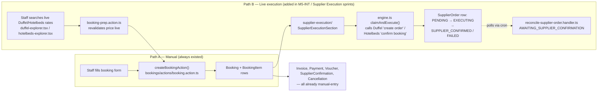
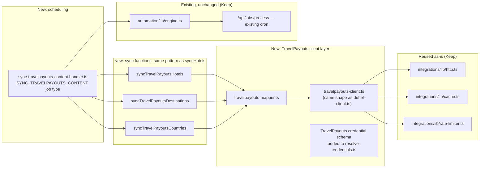

# TravelOS — Migration Report: Agency Operations OS Pivot

> **Superseded by what actually shipped.** This draft proposed keeping the
> live-execution engine disabled-but-preserved behind a flag ("zero modules
> recommended for Remove," §1 below). What actually happened across several
> follow-up sessions was more radical: the Duffel integration and the
> entire `supplier-execution/` engine were deleted outright, and then the
> agency's own financial system (invoicing, payments, the pricing engine)
> was deleted too — neither of which this plan anticipated. Nothing
> described as "preserved" or "disabled by default" in this document
> exists in the codebase. Read this file as a historical proposal that was
> *considered*, not as a description of what the codebase actually does —
> see `PROJECT.md`'s status section for current reality.

**Status:** DRAFT v2 — the proposal below was not adopted as written; see the notice above.
**Supersedes:** the v1 draft of this document (same file, revised in place per updated
engineering constraints — nothing described here has been implemented).

**Governing constraints for this revision** (explicitly set by product/engineering direction):
this is a migration, not a rewrite; the existing codebase is treated as production-quality;
nothing is deleted in the first implementation phase; feature flags are preferred over removal;
a clean extension point for direct supplier booking is preserved even though it's disabled by
default, because future customers may still want it.

---

## 1. Executive Summary

TravelOS was built as a modular monolith with two coexisting booking paths: a **manual path**
(staff types in what was purchased) and a **live-execution path** (TravelOS calls Duffel/Hotelbeds
APIs to actually place and poll a real order). The new product direction retires the second path
as the *default* behavior — but per this revision's constraints, "retires" means **disabled by
default, not deleted**.

The practical scope of this migration is smaller than a first read suggests, for a reason
confirmed by direct code audit, not assumption: `Invoice`/`Payment`, `SupplierConfirmation`,
`Voucher`, and `CancellationPolicy` were **already** manual-recording systems — none of them
call an external payment or booking API today. The only code that genuinely executes a live
purchase lives in one feature directory (`supplier-execution/`) plus a handful of call sites
into it. Everything else in the "agency operations" layer already matches the new vision as-is.

This report reclassifies every touched module into five outcomes — **Keep, Refactor, Make
Optional, Deprecate, Remove** — with **zero modules recommended for Remove in this migration**.
The live-execution engine is reclassified from "delete" (v1 draft) to **Deprecate: disabled by
default behind a configuration flag, code and schema fully preserved** — this satisfies the
requirement to keep a clean extension point for agencies who may later want direct booking, at
near-zero ongoing cost, since the code doesn't need to be touched to stay dormant.

The new work is additive: a TravelPayouts content-sync engine, built by generalizing a sync
pattern that already exists in this codebase for Hotelbeds reference data (`sync-service.ts`) —
not built from scratch.

---

## 2. Current Architecture

### 2.1 Structure

Feature-first modular monolith (Next.js 15 App Router), documented as the binding architecture
style in `PROJECT.md` §2. Each business capability lives under `src/features/<name>/` with its
own `actions/`, `queries/`, `components/`, `schemas/`, `lib/`. Shared primitives live under
`src/shared/`. This structure itself does not change.

### 2.2 The two booking paths today



Path A has always been independently usable — it was never *only* reachable through Path B.
Path B is additive machinery layered on top of the same `Booking`/`BookingItem` tables.

### 2.3 Content today

`Hotel`, `Destination`, `Country`, `City`, `Activity`, `Guide`, `TransportProvider`, `Supplier`,
`Package` are 100% manually authored via CRUD forms by agency staff — confirmed by reading the
create/update actions for each. The only exception: `sync-service.ts` already lets staff pull
Hotelbeds *reference data* (countries, destinations, hotel shells, amenities) into these same
tables via a manual "Sync now" button, tagged `source: HOTELBEDS`. This is not customer-facing
automation — it's a staff-triggered import tool, and it already proves the upsert pattern the
TravelPayouts engine needs.

### 2.4 What does NOT exist today (confirmed by audit, not assumed)

- No public REST/webhook API surface beyond `/api/auth`, `/api/uploadthing`, `/api/jobs/process`.
- No live webhook receiver — `ProviderWebhook` (schema + UI) has nothing listening on the other
  end.
- No payment-gateway execution anywhere (SaaS subscription billing via `BillingProvider` is a
  fully separate system, confirmed by reading its interface — irrelevant to this migration).
- No AI/LLM integration anywhere in the product code (see §9).

---

## 3. Future Architecture

```mermaid
graph TB
    subgraph "External"
        CUST[Traveler]
        AGENT[Agency staff]
        TP[TravelPayouts API]
        SUPPLIERS["Real suppliers — purchased<br/>OUTSIDE TravelOS, always"]
    end

    subgraph "Content layer"
        TPSYNC[TravelPayouts Sync Engine<br/>NEW — reuses job engine + sync-service pattern]
        MANUALCRUD[Manual content CRUD<br/>UNCHANGED]
        DB[(Hotels, Destinations, Countries,<br/>Cities, Packages — same tables))]
    end

    subgraph "Agency operations — UNCHANGED"
        CRM[CRM + Leads]
        QUOTE[Quotes]
        BOOK[Bookings — manual path, Path A]
        PRICE[Pricing Engine]
        FIN[Invoices, Payments, Vouchers,<br/>Confirmations, Cancellations]
    end

    subgraph "Direct booking capability — Deprecated, NOT removed"
        FLAG{{"enableDirectSupplierExecution<br/>flag — default OFF"}}
        EXEC["supplier-execution/ engine<br/>UNCHANGED CODE, dormant by default"]
        EXPLORER["Live price-check explorers<br/>Make Optional — 'Create booking' hidden unless flag ON"]
    end

    TP --> TPSYNC --> DB
    MANUALCRUD --> DB
    CUST -->|browse| DB
    CUST -->|submit request| CRM
    CRM --> QUOTE --> PRICE
    AGENT -.consults, flag-gated.-> EXPLORER
    AGENT -->|"manually purchases"| SUPPLIERS
    AGENT -->|"records purchase"| BOOK --> FIN
    FLAG -.if ON, unlocks.-> EXEC
    FLAG -.if ON, unlocks.-> EXPLORER
    EXEC -.if ON.-> SUPPLIERS

    classDef new fill:#dcfce7,stroke:#16a34a
    classDef dormant fill:#f3f4f6,stroke:#6b7280,stroke-dasharray: 4 4
    class TPSYNC new
    class FLAG,EXEC,EXPLORER dormant
```

The key structural difference from the v1 draft: there is **no removed node** in this diagram —
only a **flag boundary**. Everything inside the dormant box is real, tested, working code that
simply isn't reachable by default. This is the "clean extension architecture" the constraint asks
for: turning it back on for a specific tenant is a config change, not a re-implementation.

---

## 4. Gap Analysis

| Capability the new vision needs | Exists today? | Gap |
|---|---|---|
| Content ingestion from a third-party aggregator | Partially — pattern exists (`sync-service.ts`) for Hotelbeds only | Need a TravelPayouts client + mapper + sync functions, following the existing pattern (§10) |
| A way to disable live purchase execution per-tenant/platform-wide without deleting code | No — execution is currently always available to any tenant with connected Hotelbeds/Duffel credentials | Need a new config flag (schema + settings UI + guard checks at the 2-3 call sites) |
| A "manual purchase recording" flow that feels first-class, not like a fallback | Partially — `createBookingAction` works standalone today, but supplier name/cost/confirmation fields aren't consistently prominent in the UI | UX refactor, no new schema in most cases (fields already exist) |
| Reporting oriented around lead→quote→booking conversion and margin | Partially — the Pricing Engine computes margin; no dedicated report surfaces it yet | Out of scope for this migration; flagged as natural next roadmap item, not estimated here |
| AI-assisted content/quote/lead workflows implied by "AI-powered" positioning | Not built at all (§9) | Explicitly out of scope for this migration; noted as a gap for a future initiative, not fabricated as existing |

Nothing above requires removing existing capability to close.

---

## 5. Module Inventory

Legend: **Keep** = unchanged. **Refactor** = same module, internal changes (scope narrowing,
new guard checks, UI copy/field prominence). **Make Optional** = stays fully functional, moves
behind a flag or a secondary/advanced UI surface. **Deprecate** = stops being the default path,
code and schema fully preserved as an extension point, not actively enhanced further. **Remove**
= file deletion proposed. (Spoiler: nothing in this table is Remove.)

### 5.1 Core agency operations

| Module | Why it exists today | Fits new vision? | Classification |
|---|---|---|---|
| `crm/`, `leads/` | System of record for the client relationship and the lead pipeline (submit request → CRM → negotiation) | Yes — this *is* the new client-journey backbone | **Keep** |
| `quotes/` | Human-authored, human-priced document; the "Quotation" step | Yes, directly | **Keep** |
| `bookings/` (manual path — `booking.action.ts`) | Records what was purchased, independent of how | Yes, this becomes the primary entry point | **Refactor** — promote supplier name / supplier cost / confirmation-number fields earlier and more prominently in the creation flow (fields mostly already exist on `BookingItem`/`SupplierConfirmation`; this is a UI-prominence change, not new schema in most cases) |
| `travellers/` | Passenger records on a booking | Independent of purchase method | **Keep** |
| `invoices/`, `payments/` (customer-facing) | Records what the customer paid the agency | Already manual — confirmed no gateway execution in this path | **Keep** |
| `vouchers/` | Printable confirmation document generated from booking data | Supplier-agnostic already | **Keep** |
| `confirmations/` | Staff-entered supplier confirmation number/status — confirmed 100% manual by reading `confirmation.action.ts` | This is exactly where "Supplier confirmation number" from the new spec lives | **Keep** |
| `cancellations/` | Policy + refund-math engine on agency-controlled data | Unaffected by purchase method | **Keep** |
| `pricing/` | Cost → margin → sell-price engine | Exactly "Supplier cost / Selling price / Margin" from the new spec | **Keep** |
| `portal/` (customer-facing) | Shows the customer their trip/invoices/vouchers/documents | Sourced entirely from the manual records above | **Keep** |
| `documents/` | Generic file storage (passports, contracts) | Supplier-agnostic | **Keep** |
| `billing/` (SaaS subscription for the agency's own TravelOS plan) | Separate system entirely — confirmed by reading `BillingProvider` vs `SupplierExecutionProvider` side by side | Unrelated to this migration | **Keep** |
| `settings/`, `tenants/`, `auth/`, `users/` | Platform plumbing | Unaffected | **Keep** |
| `search/` | Internal catalog search only | Never touched a live supplier | **Keep** |

### 5.2 Content

| Module | Why it exists today | Fits new vision? | Classification |
|---|---|---|---|
| `hotels/`, `destinations/`, `activities/`, `guides/`, `transport/`, `suppliers/`, `packages/`, `package-inventory/` | Manual catalog CRUD — the content the public site and quotes draw from | Yes, and gains a second ingestion path (TravelPayouts) writing into the *same* tables | **Keep** (content models) with a **Refactor** to the write path: sync becomes a second writer alongside manual CRUD, no schema conflict since `Hotel.source`/`externalCode` already exists for exactly this purpose |

### 5.3 Integration & sync infrastructure

| Module | Why it exists today | Fits new vision? | Classification |
|---|---|---|---|
| `integrations/lib/http.ts`, `cache.ts`, `rate-limiter.ts`, `client-factory.ts`, `dto.ts`, `errors.ts` | Generic, provider-agnostic HTTP client infrastructure (retry, backoff, caching) | Directly reusable for a TravelPayouts client | **Keep** |
| `integrations/sync/sync-service.ts` | Fetch → map → upsert pipeline for Hotelbeds reference data | This *is* the template for TravelPayouts sync | **Refactor** — add TravelPayouts as a second dataset source alongside Hotelbeds/Duffel, same function shape |
| `integrations/components/sync-manager.tsx` | UI for triggering/monitoring sync runs | Extends naturally | **Refactor** — add TravelPayouts as a visible source option |
| `providers/` (credential storage, connection wizard, health/monitoring) | Generic per-tenant encrypted credential + connection-health infrastructure, currently serving Duffel/Hotelbeds/Amadeus | Still needed — now also serves TravelPayouts credentials | **Refactor** — scope narrows (less "constant booking-API traffic" monitoring relevance), gains a new provider type |
| `integrations/components/duffel-explorer.tsx`, `hotelbeds-explorer.tsx`, `amadeus-panel.tsx` | Live rate search UI, currently including a "Create booking" action | Search/price-check itself is legitimate (informs quote pricing); the purchase button is not | **Make Optional** — the search/lookup functionality stays fully available; the "Create booking" button becomes flag-gated (§5.4) rather than always-on |
| `integrations/components/create-booking-dialog.tsx` | The UI trigger for live-purchase creation | Only relevant when direct execution is enabled | **Make Optional** — rendered only when `enableDirectSupplierExecution` is on |
| `integrations/actions/booking-prep.action.ts` | Revalidates a live rate, then creates a Booking from it | The price-revalidation logic is reusable by the optional price-check tool; the "auto-create a Booking from a live rate" behavior should not be the default | **Refactor** — split: keep price-revalidation as a standalone, flag-independent utility; gate the auto-booking-creation call behind the same flag as §5.4 |
| `automation/` (Job engine, retry, cron, `SEND_COMMUNICATION` handler) | Generic scheduled/retryable job infrastructure | Directly reused as the TravelPayouts sync scheduler | **Keep** |

### 5.4 Direct supplier execution (the module the pivot is about)

| Module | Why it exists today | Fits new vision? | Classification |
|---|---|---|---|
| `supplier-execution/` (entire feature: `engine.ts`, `execution.action.ts`, `error-classification.ts`, `idempotency.ts`, `reconciliation.ts`/`reconciliation-plan.ts`, `status.ts`, `providers/duffel/`, `providers/hotelbeds/`, `queries/`, `schemas/`, `components/SupplierExecutionSection`) | Built (Supplier Order Execution Capability, then Booking Status Resolution Capability sprints) to let TravelOS place and track a real supplier order — genuinely correct, tested engineering (idempotency keys, compensation on partial failure, error classification, capped backoff) | Not the default flow anymore, **but** the constraint to preserve a clean extension point for agencies who may want direct booking means this code has real future value | **Deprecate** — wrapped in a single guard check (`isDirectSupplierExecutionEnabled(tenantId)`) at its entry points; `SupplierExecutionSection` renders nothing when the flag is off; **zero files deleted**. This is the one module where "Deprecate" carries the most weight in this report. |
| `automation/handlers/reconcile-supplier-order.handler.ts` | Polls a supplier order TravelOS itself placed (Hotelbeds "ON REQUEST" async confirmation) | Meaningless without live orders being placed, but harmless to leave registered — it simply never finds work to do when no `SupplierOrder` rows are being created | **Deprecate** — stays registered; add an early-return guard consistent with the flag so it doesn't even attempt a no-op DB query needlessly, but the handler file itself is untouched otherwise |
| `SupplierOrder` / `SupplierOrderEvent` Prisma models + `SupplierOrderStatus`/`SupplierPaymentMode`/`SupplierOrderEventType` enums | Backing store for the execution engine above | Required by the preserved extension point — deleting the schema would defeat the "clean extension architecture" requirement | **Keep** (schema only; no new writes unless the flag is on for that tenant) |
| `ProviderWebhook` model + `addProviderWebhookAction`/`deleteProviderWebhookAction` + the Webhooks tab in `provider-detail-tabs.tsx` | Originally scoped for supplier booking-status push notifications | No live receiver exists today regardless of this pivot (confirmed: no route under `src/app/api/webhooks/**`) — this finding is independent of the business-model change | **Deprecate** — move the tab into an "Advanced" section rather than the primary provider-detail view; schema and actions untouched. Not classified Remove, per constraint #1: it *could* be repurposed (a real webhook receiver is plausible future work for any provider, TravelPayouts included), so it isn't proposed for deletion. |

**On removal, explicitly:** No module in this report is recommended for file deletion. Where a
v1 draft of this document proposed removal, this revision reclassifies it as Deprecate
(flag-gated dormancy) instead, per constraint #6/#7/#8. Consequently: **no functionality is
lost, nothing needs a replacement, and no historical data migration is required** — the tables
and code stay exactly as they are, just unreached by default for new activity.

---

## 6. Database Impact

**No destructive changes. No drops. No column removals.** Everything below is additive.

| Change | Type | Risk |
|---|---|---|
| `ProviderType` enum: add `TRAVELPAYOUTS` | Additive enum value | None — precedent exists (`BOOKING`/`EXPEDIA`/`TRAVELPORT` are already unused placeholder values in this enum) |
| `TenantSettings`: add `enableDirectSupplierExecution: Boolean @default(false)` (naming TBD during implementation) | New nullable/defaulted column | None — new tenants get the new default; **existing tenants need an explicit decision** (see §12, Risks) about whether they're migrated to `true` (preserve current behavior) or `false` (align with new default). Recommendation: default new column to `true` for any tenant with an existing `SupplierOrder` row, `false` otherwise, decided by a one-time backfill script, not a blanket default. |
| `Country`/`City`/`Destination`: confirm/add `source`/`externalCode` pair (mirroring `Hotel`'s existing pattern) | Additive columns, if not already present | Needs a schema read during implementation to confirm which models already have this pair |
| New table: `ProviderSyncItem` (optional — per-item sync outcome, avoids re-processing a whole batch on partial failure) | New table | None — purely additive, only needed once TravelPayouts sync volume justifies it (can ship without it in Phase 1) |
| `SupplierOrder`/`SupplierOrderEvent` | **No schema change.** Policy-only: no new writes when the flag is off for a tenant. | None |

---

## 7. API Impact

TravelOS has no public REST API surface today beyond `/api/auth`, `/api/uploadthing`, and
`/api/jobs/process` (confirmed by directory listing). All feature logic runs through Next.js
Server Actions, which are not versioned, external contracts — they're internal RPC boundaries
that can change without a deprecation cycle affecting outside consumers.

| Change | Impact |
|---|---|
| New server actions for TravelPayouts sync trigger/status | Purely additive |
| `booking-prep.action.ts` gains a guard check before the auto-booking-creation branch | Existing signature unchanged; behavior only changes for tenants with the flag off, where it now returns a clear "direct execution is disabled" result instead of proceeding — **this is a behavior change for any tenant currently relying on it**, which is why it's flag-gated, not universal, so existing users of the capability aren't silently broken (see §12) |
| `execution.action.ts` entry points gain the same guard | Same as above |
| No changes to any customer-portal-facing action | Portal reads the same `Booking`/`Invoice`/`Voucher` data regardless of how the booking was created |

---

## 8. UI Impact

| Surface | Change |
|---|---|
| Booking creation form | Refactor: supplier name / supplier cost / confirmation-number fields promoted, not new fields |
| `duffel-explorer.tsx` / `hotelbeds-explorer.tsx` / `amadeus-panel.tsx` | Search/price-check UI unchanged; "Create booking" button conditionally rendered on the flag |
| `create-booking-dialog.tsx` | Only mounted when the flag is on |
| `SupplierExecutionSection` (on the booking detail page) | Renders nothing (or a small "Direct execution is disabled for this workspace" note with a link to settings, for discoverability) when the flag is off, instead of being removed from the page tree |
| Settings | New toggle: "Enable direct supplier booking execution" with explanatory copy about what it does (calls Duffel/Hotelbeds APIs to place real orders) and that it's off by default |
| `sync-manager.tsx` | Gains TravelPayouts as a visible sync source, same "last run / next run / processed" pattern already used for Hotelbeds/Duffel |
| `provider-detail-tabs.tsx` | Webhooks tab moved into an "Advanced" disclosure rather than a primary tab (not removed) |
| Dashboard nav / copy sweep | Any "book now"/"confirm booking" language implying automated purchase gets a copy pass, independent of the flag — this is about honesty of language, not functionality |

---

## 9. AI Impact

Direct finding from the audit: **there is no AI/LLM code anywhere in the TravelOS product**
(`src/`) today — confirmed by searching for any OpenAI/Anthropic/AI-SDK/LLM-adapter references
and finding none. The "AI-powered" framing in the new product vision is a **positioning claim**,
not a description of an existing capability, and this report will not pretend otherwise.

This migration has **no impact** on AI capability, because there is none to impact. What this
report will do instead: note where genuine AI features would naturally attach later, without
estimating or scoping them as part of this migration:

- **Content enrichment** — TravelPayouts sync (§10) will pull raw hotel descriptions/facility
  lists; an LLM pass to normalize/enrich these into agency-brand-voice copy is a natural
  downstream feature, not a dependency of the sync engine itself.
- **Quote drafting assistance** — the `quotes/` module already has structured line items; a
  "draft a quote from this lead's stated preferences" assistant is a plausible future feature
  that would read existing `Lead`/`Package` data, not require new core data.
- **Lead scoring / next-best-action** — `leads/` already has stage, source, and activity history;
  a scoring model is additive analytics, not a schema change.

None of the above is part of this migration's scope, budget (§13), or approval ask. It's
included here only because the report explicitly requires an AI Impact section, and the honest
answer is "none today, here's where it would plug in later" rather than a fabricated feature.

---

## 10. Synchronization Engine Design (TravelPayouts)

Unchanged from the v1 draft's design — this section already followed a reuse-first approach
consistent with the new constraints, so it's carried forward with light edits.

### 10.1 Principle

Reuse `sync-service.ts`'s proven shape (`fetch from provider client → map through DTO layer →
upsert into local reference tables, keyed by a stable external code`) rather than building a new
pipeline. This is a **Refactor** of an existing module (§5.3), not new architecture.

### 10.2 Components



### 10.3 Requirement → existing infrastructure mapping

| Requirement | Met by |
|---|---|
| Scheduled jobs | Existing job engine + cron, proven in production use for `SEND_COMMUNICATION` |
| Incremental updates | `runDatasetSync()`'s existing upsert-by-external-code pattern; true delta-only fetch depends on TravelPayouts API capabilities (confirm during the spike, §11 Phase 1) |
| Retry | `integrations/lib/http.ts`'s existing retry/backoff, reused directly |
| Logging | `ProviderLog`/`ProviderSync` models, reused as-is |
| Monitoring | Existing sync-history UI, reused as-is |
| Error recovery | Job engine's existing retry/backoff/dead-letter semantics, reused as-is |

### 10.4 Genuinely new work

TravelPayouts HTTP client + auth (needs API docs — spike, §11 Phase 1), the DTO mapper, the
credential model decision (per-tenant vs. platform-shared key — a ToS question), and an image
storage decision (direct URL vs. re-upload through `src/shared/lib/storage/`).

---

## 11. Migration Phases

### Phase 1 — No-risk changes (purely additive, zero behavior change for any existing tenant)

- Add `TRAVELPAYOUTS` to `ProviderType` enum.
- Add the `enableDirectSupplierExecution` config field to `TenantSettings`, **defaulted so
  current behavior is preserved for every existing tenant** (backfill script: `true` for any
  tenant with existing `SupplierOrder` activity, `false`/unset otherwise — needs the "any real
  usage today?" question from §12 answered first).
- Spike: TravelPayouts API access, auth scheme, endpoint/pagination/rate-limit shape.
- Build the TravelPayouts client + mapper + sync functions (§10) — inert until wired into the
  job handler and UI, so nothing changes for any user yet.
- Confirm/add `source`/`externalCode` fields on `Country`/`City`/`Destination` if missing.
- Documentation: annotate `PROJECT.md` §21/§24/§28/§31 as "superseded by this migration,"
  without deleting the history.
- **Nothing is deleted. Nothing user-visible changes. Fully reversible by not merging.**

### Phase 2 — Refactoring

- Wire the TravelPayouts sync functions into a registered `SYNC_TRAVELPAYOUTS_CONTENT` job type
  and the `sync-manager.tsx` UI as a new source.
- Add the guard checks (`isDirectSupplierExecutionEnabled`) at the entry points identified in
  §5.4/§7 — `execution.action.ts`, `booking-prep.action.ts`'s auto-booking-creation branch,
  `SupplierExecutionSection`'s render, `create-booking-dialog.tsx`'s mount condition.
- Add the Settings UI toggle with explanatory copy.
- Refactor the booking-creation form to promote supplier/cost/confirmation fields.
- Split `booking-prep.action.ts`'s price-revalidation logic from its auto-booking-creation call,
  so the former stays usable by the optional price-check tool independent of the flag.
- UI copy sweep for "book now"/"confirm booking" language.
- **Still nothing deleted.** Existing tenants with the flag on (per the Phase 1 backfill) see no
  change; new tenants default to the new, simpler flow.

### Phase 3 — Optional removals

Per constraint #6, "removal" in this phase means **UI-surface and default-config removal**, not
file deletion:

- Flip the default for the flag to `false` platform-wide (new tenants already default this way
  from Phase 1; this step is about whether any legacy tenant's flag gets flipped off too, which
  needs explicit sign-off per tenant, not a blanket switch).
- Move the Webhooks tab into an "Advanced" disclosure.
- Move the live-execution UI (explorer "Create booking" button, execution section) fully behind
  the "Advanced"/flag-gated surface for all tenants, not just new ones (if approved per the
  previous bullet).
- **Still zero files deleted.**

### Phase 4 — Cleanup after production validation

This phase is explicitly **deferred and requires its own future approval** — it is not part of
this migration's ask. After a full release cycle confirms (via actual usage telemetry, not
assumption) that no tenant has the flag on and no `SupplierOrder` rows have been created in that
window, *optionally* revisit:

- Whether `ProviderWebhook`'s dead UI is worth deleting outright (low value either way, since it
  costs nothing to leave, per constraint #1's "don't delete what could be repurposed").
- Whether any of the deprecated `supplier-execution/` code should be archived to a separate,
  lower-visibility location in the repo (still not deleted) to reduce cognitive load for new
  engineers, versus leaving it in place since it costs nothing to leave.

No specific deletions are proposed even for this phase in this report — it's named here only
because the requested structure calls for it, and the honest answer is "revisit later with real
data, don't pre-commit to it now."

---

## 12. Risks

| Risk | Mitigation |
|---|---|
| Unknown existing tenant usage of direct execution — flipping a default wrong either breaks a real user's workflow or silently leaves risky live-purchase code reachable when it shouldn't be | Phase 1 explicitly starts with confirming real `SupplierOrder` usage before any default changes (open question, §14) |
| TravelPayouts API unknowns (auth, rate limits, content completeness/quality) block the Phase 1 spike | Time-boxed spike as the very first task; if TravelPayouts turns out to be a poor fit, the rest of Phase 1's client/mapper work is cheap to redirect at a different aggregator without having touched any existing module |
| Dual-mode complexity — every guard check is a new branch to test (flag on vs. off) | Keep the guard surface minimal (4 call sites identified in §5.4/§7/§11), covered by tests for both branches before Phase 2 ships |
| Content-quality variance from third-party sync data (descriptions, images) mixed with manually-curated content | `Hotel.source`/`externalCode` already distinguishes synced from manual rows; staff can always manually override a synced hotel's fields, same as today's Hotelbeds sync behavior |
| Image hotlinking reliability if TravelPayouts image URLs are stored directly rather than re-uploaded | Start with direct URLs (matches existing `coverImageUrl` pattern); revisit only if broken links become a measured problem |
| Credential/ToS ambiguity — can one platform key serve all tenants, or does each need their own? | Legal/product question, not engineering — blocks nothing in Phase 1's client-building work, only blocks going live with real sync |
| Scope creep — "Phase 4 cleanup" quietly becoming "let's just delete it now" without fresh approval | This report explicitly gates Phase 4 behind its own future approval step (§11) |

---

## 13. Estimated Engineering Time

Rough order-of-magnitude, in engineer-days, assuming one engineer familiar with this codebase
(this session's own throughput on comparable prior sprints in this repo is the reference point).
The TravelPayouts spike is the only genuinely open-ended item.

| Phase | Estimate | Main driver of uncertainty |
|---|---|---|
| Phase 1 | 4–7 days | TravelPayouts API spike could be 1 day (clean, documented API) or 3-4 days (sparse docs, trial-and-error) |
| Phase 2 | 3–5 days | Guard-check wiring is small; the booking-form UX refactor is the larger piece |
| Phase 3 | 1–2 days | Mostly config/default changes and UI surface relocation, once Phase 2 lands |
| Phase 4 | Not estimated | Explicitly deferred to a future report, contingent on production data |
| **Total (Phases 1-3)** | **8–14 days** | |

---

## 14. Final Recommendation

**Proceed with Phase 1 only, pending answers to three questions:**

1. **TravelPayouts access** — do credentials/docs already exist, or does that need to be
   arranged first? This is the literal first task.
2. **Existing `SupplierOrder` usage** — are there any tenants (demo or production) with real rows
   in that table today? This determines the Phase 1 backfill default and whether Phase 3's
   "flip the default for everyone" step is even a live question or moot.
3. **Credential model** — per-tenant TravelPayouts keys or one platform-shared key (ToS-dependent)?

None of the four phases require an irreversible decision up front — Phase 1 is fully additive
and reversible by simply not merging it, which is why it's the recommended starting point rather
than asking for sign-off on the whole migration at once. Phases 2 and 3 can each be approved
independently once Phase 1's findings (especially the TravelPayouts spike and the existing-usage
question) are in hand.

No code has been changed to produce this report.
